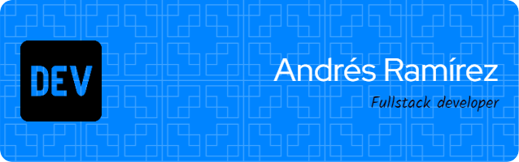

  

<h2 align="left">Hey there! I'm Andrés Ramírez</h2>

### 👨🏻‍💻 About Me

💻 &nbsp;I'm a *Computer Systems Engineer* with experience in *web development, cloud deployment, and API design*.  
🚀 &nbsp;Passionate about building *scalable and efficient* software solutions.  
🏛 &nbsp;Currently based in *Xalapa, Veracruz, Mexico*.  
📚 &nbsp;Always learning new technologies, especially in *web development, cloud computing, and software architecture*.  
💬 &nbsp;Feel free to reach out to me for *collaborations, consulting, or tech discussions*.  

---

### 🔥 My Projects

#### 🚀 *#NoTeLaJueguesConLasDrogas Campaign Website*  
✔ Developed a *full-stack CMS* to manage articles, videos, and news.  
✔ Led the *deployment process* on *Google Cloud*.  
✔ Built using *Vue.js, Express.js, JavaScript, and MySQL*.  
📅 *August 2023 - February 2024*  

#### 🌐 *DIF Xalapa Management System*  
✔ Led the development of a *web system for managing social assistance requests*.  
✔ Implemented *user management, document handling, and inventory control*.  
✔ Deployed the application on *AWS*, and it is currently in *active use*.  
✔ Built using *React.js, Express.js, JavaScript, and MySQL*.  
📅 *July 2024 - October 2024*  

#### 🌱 *Seed Processing Traceability API*  
✔ Developed a *REST API* to track seed processing in *biodiversity nurseries*.  
✔ Covered stages like *collection, cleaning, selection, testing, and storage*.  
✔ Built using *TypeScript, NestJS, Prisma, and PostgreSQL*.  
📅 *August 2024 - January 2025*  

---

### ⚙ Tech Stack

#### 🔹 *Programming Languages*  

#### 🔹 *Backend & Web Development*  

#### 🔹 *Frontend & UI*  

#### 🔹 *Cloud & DevOps*  

#### 🔹 *Databases & ORM*  

#### 🔹 *Version Control & Tools*  

---

### 📫 Contact Me  

📧 *Email:* andresrmzmtz9@gmail.com  
🔗 *LinkedIn:* [Andrés Antonio Ramírez Martínez](https://www.linkedin.com/in/andres-antonio-ramirez-martinez-17292b303)  
💻 *GitHub:* [@AndresR2002](https://github.com/AndresR2002)  

---

⭐ *Thanks for visiting my GitHub portfolio!* 🚀  
